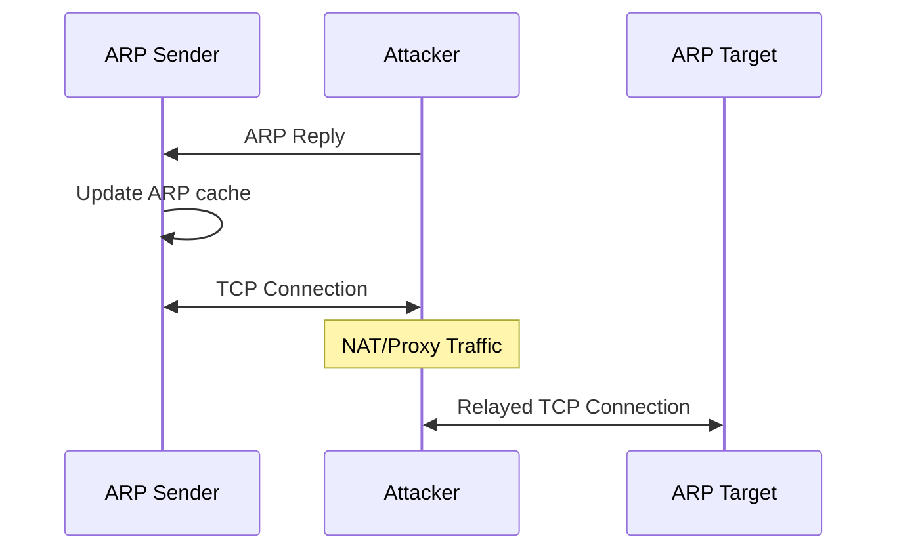

---
tags:
- term
---

[[notes/ARP Cache|ARP Cache]] poisoning is a method for an [[notes/Attacker|attacker]] to establish an [[notes/Adversary in the Middle|AITM position]] between an ARP [[notes/ARP Sender|sender]] and [[notes/ARP Target|target]]. It occurs when an attacker pollutes a sender's ARP cache with a record such that the target's IP address is associated with the attackers's MAC address, allowing the attacker to intercept traffic intended for the target and [[notes/Relaying Traffic|relay]] it accordingly.

ARP cache poisoning is possible because there is no broadly accepted standard for authenticating [[notes/ARP Reply|ARP replies]]. The reply can be solicited by a request, or unsolicited (see [[notes/Gratuitous ARP|gratuitous]]).

Effective application of this this technique often leads to capture of credentials that can be used for privilege escalation and/or lateral movement, but can also be used to achieve other objectives through manipulation of traffic as it's relayed by the attacker.

[mitre-aitm]: https://attack.mitre.org/techniques/T1557/