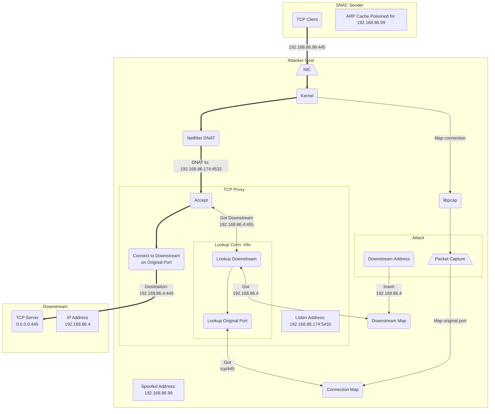

---
tags:
- concept
---

Eavesarp uses [Netfilter][netfilter] tables to DNAT poisoned traffic to the [[notes/Proxying Traffic|TCP and UDP proxy]] initialized during startup. Inspecting Netfilter tables after starting Eavesarp will reveal a table like the one depicted below.

```bash
nft list ruleset ip
```

![[notes/artifacts/nftrule-example.png]]

For TCP and UDP traffic originating from addresses listed in the `spoofed_ips` set, the `prerouting` chain rewrites the destination address and port such that it's sent to the proper proxy. The `spoofed_ips` set is updated by Eavesarp any time that a poisoning attack starts or ends, i.e., the sender's address is added or removed, respectively.

[netfilter]: https://www.netfilter.org/

