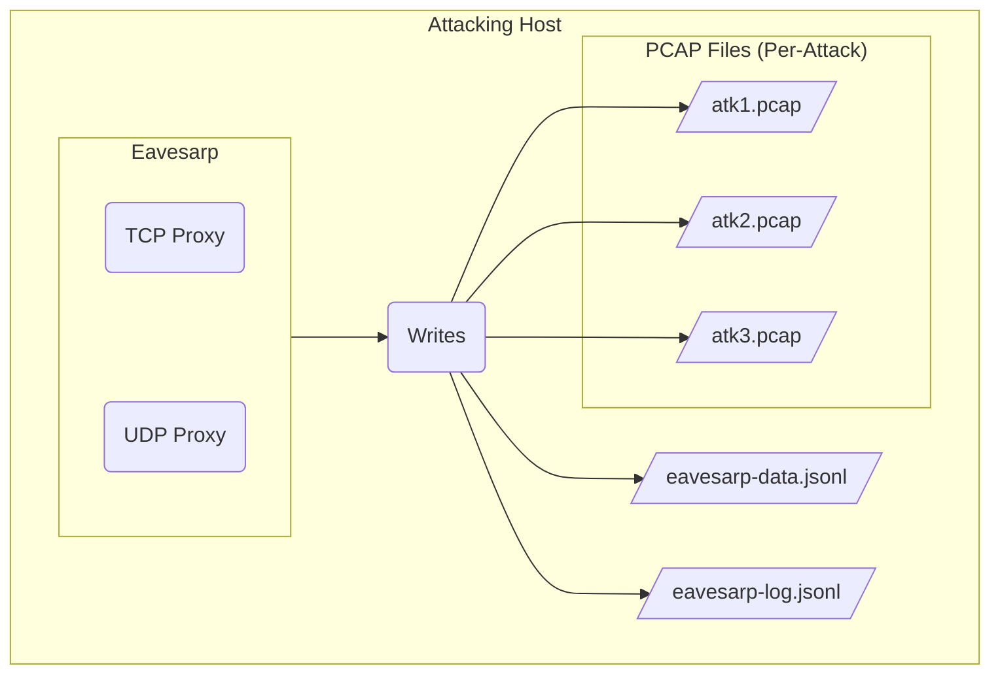

---
tags:
- concept
---

As illustrated below, Eavesarp produces three types of output files. Log files are all formatted as [JSONL][jsonl-link] for simplicity and [[#Quickly Decoding Text Data|streamlined parsing]].

- [[#PCAP Files]]
- [[#The Data JSONL File]]
- [[#The Log JSONL File]]



# PCAP Files

TL;DR:

- Configured on a per poisoning attack
- Optional
- Useful for binary protocols
- ARP traffic is omitted

Eavesarp can optionally write all packets captured during a poisoning attack to a PCAP file compatible with tools like [Wireshark][wireshark-link], [TCPDump][tcpdump-link], and [PCredz][pcredz-link]. Simply supply a unique file path to the **Output PCAP File** field of the attack configuration form to generate this file.

# The Data JSONL File

TL;DR:

- Useful for text protocols
- Data intercepted from proxies is Base64 encoded into JSON structures
- Saved as JSONL
- Always captures data sent from the poisoning attack victim
- Downstream is optional

During poisoning attacks, Eavesarp will intercept traffic passing through the [[notes/Proxying Traffic|proxies]], serialize it to a simple JSON data structure, and write it to disk in JSONL format. This facilitates quick wins in situations where the application protocol is text-based, like HTTP.

## Data JSON Structure

The following example outlines the data JSON structure.

```json
{
  "time": "2025-04-28T06:57:58.534604659-04:00",
  "sender": "downstream",
  "victim_address": {
    "ip": "192.168.86.3",
    "src_port": "54506",
    "dst_port": "445",
    "transport": "tcp"
  },
  "spoofed_address": {
    "ip": "192.168.86.99",
    "port": "445",
    "transport": "tcp"
  },
  "proxy_address": {
    "ip": "192.168.86.174",
    "port": "46051",
    "transport": "tcp"
  },
  "downstream_address": {
    "ip": "192.168.86.4",
    "port": "445",
    "transport": "tcp"
  },
  "transport": "tcp",
  "data": "d3RmIG04Cg=="
}
```

### Key Fields of the Data JSON Structure

- **sender** - Indicates which side of the proxied connection sent the data
	- Possible values: *victim* or *downstream*
	- If a downstream isn't configured for an attack, the value is always *victim*
- **victim_address** - Connection information related to the victim of the poisoning attack
- **spoofed_address** - Connection information related to the spoofed address that Eavesarp poisoned the victim's ARP cache with
- **proxy_address** - Connection information related to the proxy used to accept the connection
- **downstream_address** - Where the connection was proxied too
	- *null* when no downstream is configured

## Quickly Decoding Text Data

The following one-liner can be used to quickly decode and dump all records from a data file.

```bash
.data eavesarp-data.jsonl -r | base64 -d | less
```

>[!NOTE] Regarding Binary Protocols
>PCAP analysis is the most viable approach for extracting actionable data from binary protocols. (See [PCredz](https://github.com/lgandx/PCredz))

# The Log JSONL File

This file contains common events emitted by Eavesarp. It's useful for debugging and constructing attack timelines for reports.

[jsonl-link]: https://jsonlines.org/
[pcredz-link]: https://github.com/lgandx/PCredz
[wireshark-link]: https://www.wireshark.org/
[tcpdump-link]: https://www.tcpdump.org/