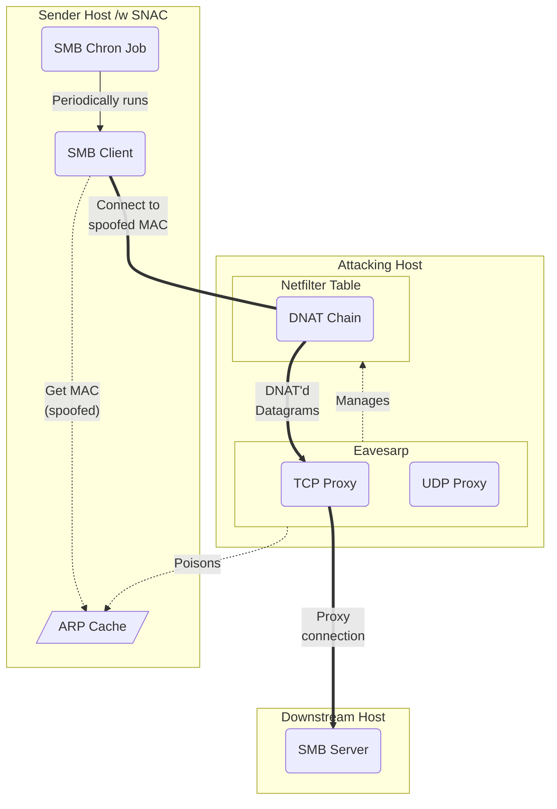
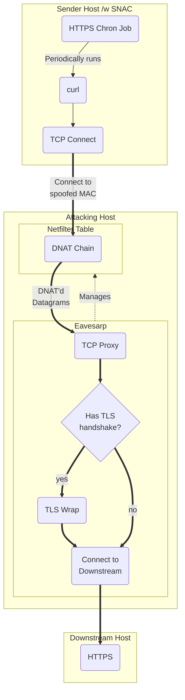

---
tags:
- concept
---

During startup, Eavesarp takes two initialization steps to prepare the environment for conversation poisoning and traffic proxying.

First, a TCP proxy and UDP proxy is started on random ports. These servers facilitate:

1. [[#Proxying Traffic to Downstream Hosts]]
0. Application Data Logging (See [[notes/Output Files#The Data JSONL File|Output Files]])

Second, an NFT table is created that will DNAT traffic originating from the senders of poisoned conversations to the proxy servers. Eavesarp manages various attributes of the NFT table throughout the life cycle of poisoning attacks. See [[notes/DNAT|this resource]] for specifics on how DNAT implemented.

# Proxying Traffic to Downstream Hosts

## Handling TCP

Most applications use TCP as a transport protocol, which implements a three-way handshake to establish a connection between the client and server prior to sending application data. Unless a listener is available to complete the handshake, only connection information sent in SYN packets can be obtained.

To get application data from connections, Eavesarp starts a TCP proxy during initialization that handles connection establishment and acts as an intermediary with a downstream TCP server.

Below is a very basic illustration that demonstrates the flow of a proxied SMB connection after poisoning the ARP cache of a sender that periodically runs a chron job that uses smbclient to access a server.

## Handling TLS

The TCP proxy seamlessly wraps connections in TLS when the initial data received from the sender contains a TLS handshake, enabling interception and logging of cleartext data as it passes through the proxy.

>[!NOTE] Regarding Certificate Verification
> Connections will fail if the application configured with a SNAC enforces certificate verification.

>[!NOTE] Proxy Certificates are Dynamically Generated
>X509 certificates are dynamically generated. The CN of the certificate is the name requested by the sender and the SAN is populated with values retrieved from the database that was obtained through reverse name resolution. All additional fields are populated with randomly generated values.

## Handling UDP

TBD