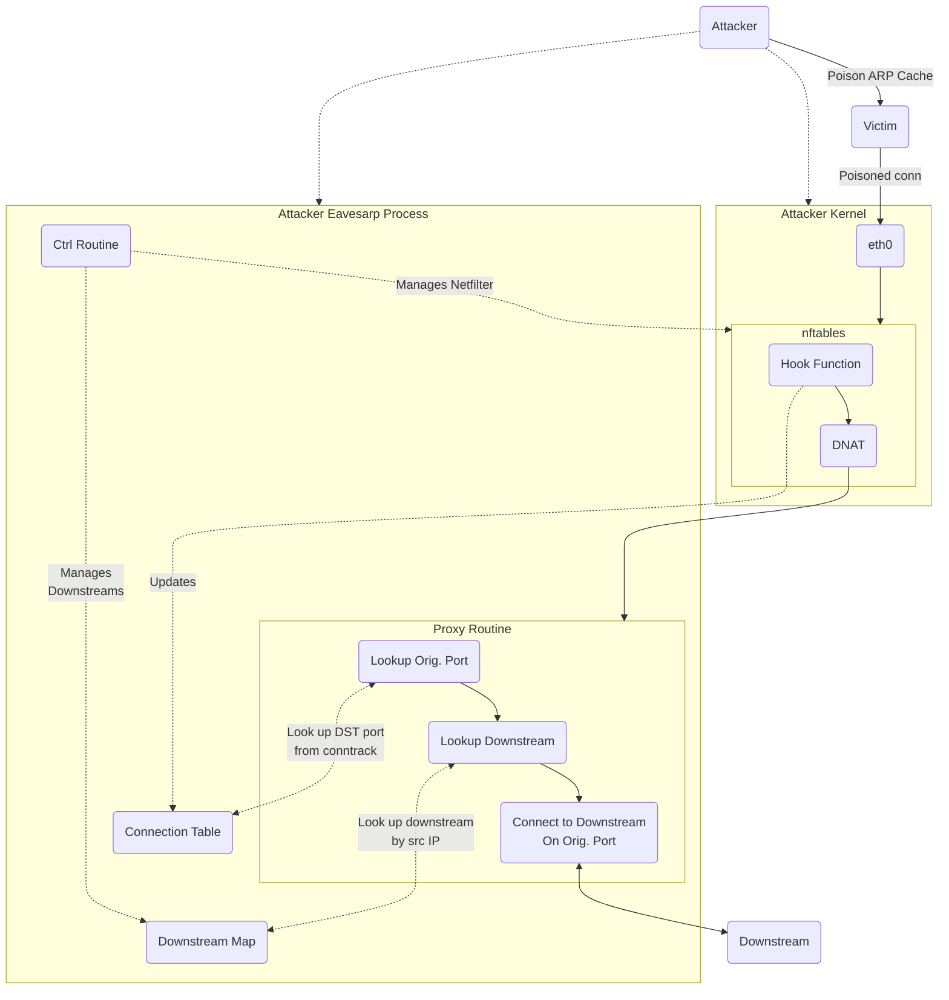

# Problem

Client applications that use TCP as a transport will not send data until after
connection establishment, thus only the initial SYN request will be received
unless a listener is running.

Even when a TCP listener is available to accept the connection request, SSL/TLS
becomes a new challenge.

# Solution: Netfilter Prerouting Hook and Destination NAT (DNAT)

A Netfilter prerouting hook function is used to detect new poisoned connections
and capture the original connection details before a destination NAT (DNAT) rule
is applied to redirect the connection to a TLS-aware TCP proxy. The TCP proxy
references the in-memory connection details set by the hook function and connects
to either the default TCP server or a downstream set by the poisoning attack.

The flow looks roughly like:

## Default TCP Server

standalone tls-aware tcp server handles all connections for attacks
without a downstream configured

## TCP Reverse Proxy

single tls-aware tcp proxy server handles all connections for attacks
with a downstream